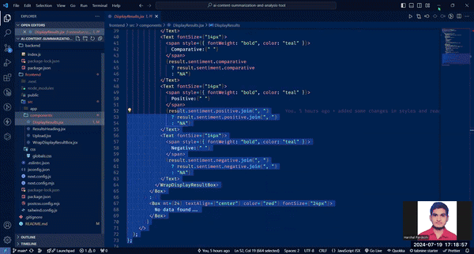

# AI-Powered Content Summarization & Analysis Tool

This project demonstrates an AI-powered content summarization and analysis tool using Next.js for the front-end and Node.js (Express.js) for the back-end. The application allows users to upload text content, receive a summarized version with key insights, and display these insights clearly. Optionally, the project can be extended to include data visualizations and user authentication.

## Features:

- Front-End
  - Upload Form: Supports text uploads in formats like plain text, HTML, and doc files.
  - Display Summaries: Shows concise summaries of uploaded text.
  - Sentiment Analysis: Displays sentiment scores and magnitudes.
  - Entity Recognition: Highlights key entities (names, organizations, locations).
  - Responsive Design: Ensures usability on various devices.
  - Error Handling: Manages and reports errors to the user.
- Back-End
  - API Endpoints: Handles text upload and analysis requests.
  - AI Integration: Utilizes summarizer, summary, tokenizer, sentiment packages for text and uploaded document analysis.
  - Text Processing: Summarizes text and extracts insights.

## Deployment:

- [Frontend](https://ai-content-summarization-and-analysis-tool-frontend.vercel.app/)
- [Backend](https://ai-content-summarization-and-analysis.onrender.com)

## Project Demonstration

**Image Preview:**



**Video Overview:**

[View Video](https://drive.google.com/file/d/1f5vwMLh_y5y4NZRKYhyx3nZqFqzGIzH8/view?usp=sharing)

## Getting Started

**First, clone the repository:**

```bash
git clone https://github.com/Hashal890/ai-content-summarization-and-analysis-tool.git
cd ai-content-summarization-and-analysis-tool
```

### Front-End Setup

Navigate to the `frontend` directory and install dependencies:

```bash
cd frontend
npm install
# or
yarn install
# or
pnpm install
# or
bun install
```

Run the development server:

```bash
npm run dev
# or
yarn dev
# or
pnpm dev
# or
bun dev
```

### Back-End Setup

Navigate to the `backend` directory and install dependencies:

```bash
cd backend
npm install
# or
yarn install
# or
pnpm install
# or
bun install
```

Run the back-end server:

```bash
npm run dev
# or
yarn dev
# or
pnpm dev
# or
bun dev
```

## Technologies used

- [JavaScript](https://developer.mozilla.org/en-US/docs/Web/JavaScript)
- [Next.js](https://nextjs.org/docs)
- [Express.js](https://expressjs.com/en/starter/installing.html)
- [Multer](https://www.npmjs.com/package/multer)
- [Natural](https://www.npmjs.com/package/natural)
- [Sentiment](https://www.npmjs.com/package/sentiment)
- [Node Summarizer](https://www.npmjs.com/package/node-summarizer)
- [Axios](https://www.npmjs.com/package/axios)
- [Body Parser](https://www.npmjs.com/package/body-parser)
- [Dotenv](https://www.npmjs.com/package/dotenv)
- [Cors](https://www.npmjs.com/package/cors)
- [Chakra-UI](https://v2.chakra-ui.com/getting-started)
- [React Icons](https://react-icons.github.io/react-icons/)
- [CSS](https://developer.mozilla.org/en-US/docs/Web/CSS)
- [HTML](https://developer.mozilla.org/en-US/docs/Web/HTML)
- [Vercel](https://vercel.com/)
